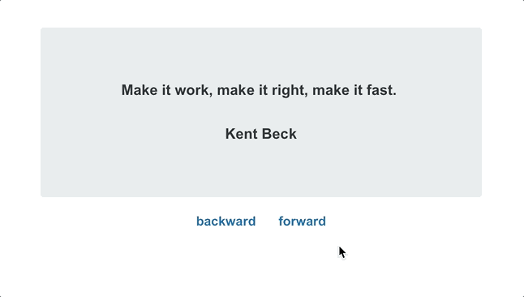

# Steppp

Steppp is a small library for quickly creating multi-step forms, carousels, and other experiences. It emphasizes a flexible developer experience and a small bundle footprint. In fact, this is why "Steppp" has only three "p"s. Any more would've been too much bloat.

<p align="center">
  
</p>

## Getting Started

### Install Steppp

If you're using a package manager, install it:

`yarn add @ramseyinhouse/steppp` or `npm install @ramseyinhouse/steppp`.

Or, you can load it via CDN:

```html
<script src="https://unpkg.com/@ramseyinhouse/steppp"></script>
```

### Set Up Base CSS

In order to Steppp to behave correctly, you'll need the following CSS:

```css
#steppp {
  position: relative;
}

.step {
  display: none;
  position: absolute;
  left: 0;
}

[data-steppp-active] {
  display: block;
}

[data-steppp-wrapper] {
  position: relative;
  overflow: hidden;
}
```

## Usage

### Initialize Steppp

To set up a basic instance of Steppp, select an element and pass it to `Steppp`.

```js
import Steppp from "@ramseyinhouse/steppp";

const element = document.getElementById("targetElement");

Steppp(element);
```

### Set Up Steps

Steps can be configured in three ways. After choosing an option, be sure to add a `data-steppp-active` attribute to the initial step you'd like to appear.

**As direct children of a target element:**

```html
<div id="steppp">
  <section data-steppp-active>first</section>
  <section>second</section>
  <section>third</section>
</div>
```

**As direct children within a `data-steppp-wrapper` element:**

```html
<div id="steppp">
  <div data-steppp-wrapper>
    <section data-steppp-active>first</section>
    <section>second</section>
    <section>third</section>
  </div>
</div>
```

**As elements that have a predetermined selector:**

```html
<div id="steppp">
  <section data-steppp-active class="step">first</section>
  <form>
    <section class="step">>second</section>
    <section class="step">>third</section>
  </form>
</div>
```

When choosing this approach, you'll need to pass the selector to the `stepSelector` option during initialization:

```js
const element = document.getElementById("targetElement");

Steppp(element, {
  stepSelector: ".step",
});
```

### Consider Naming Your Steps

If your multi-step flow will jump around a bit instead of moving through steps in a linear fashion, you'll need to name your individual steps with a `data-steppp-name` attribute. More on non-linear movement below.

```html
<div id="steppp">
  <section data-steppp-name="first_step" data-steppp-active>first</section>
  <section data-steppp-name="second_step">second</section>
  <section data-steppp-name="third_step">third</section>
</div>
```

### Move From Step to Step

Steppp comes with two API approaches -- an imperative (you dictate when it'll advance in your code) and declarative (behavior is described by setting various `data-steppp-*` attributes).

#### Imperative API

Create a new instance by calling `Steppp` and passing a target element. Functions will be returned for moving forward, backward, or directly to a specific step (see more on this below).

```js
const element = document.getElementById("targetElement");
const { forward, backward, moveTo } = Steppp(element);

document.querySelector("#forward").addEventListener("click", () => {
  forward();
});

document.querySelector("#backward").addEventListener("click", () => {
  backward();
});

document.querySelector("#moveToStepA").addEventListener("click", () => {
  moveTo("step_a");
});
```

#### Declarative API

The declarative approach requires that you place `data-steppp-forward`, `data-steppp-backward` on the elements you'd like to trigger particular movements.

```html
<div id="steppp">
  <div data-steppp-wrapper>
    <section data-steppp-active>first</section>
    <!-- ...other steps -->
  </div>

  <button data-steppp-forward>Forward</button>
  <button data-steppp-backward>Backward</button>
</div>
```

You can also tell elements to move Steppp to a particular step when clicked with a `data-steppp-to` attribute.

```html
<div id="steppp">
  <div data-steppp-wrapper>
    <section data-steppp-active>
      some step
      <button data-steppp-to="third_step">Go to Step</button>
    </section>
    <!-- ...other steps -->
    <section data-steppp-name="third_step">another step</section>
  </div>
  <button data-steppp-backward>Backward</button>
</div>
```

### Customizing the Animation

Steppp relies on the [Web Animations API](https://developer.mozilla.org/en-US/docs/Web/API/Web_Animations_API) to power step transitions. By default, a simple fade is configured by using frames that [change the opacity](https://github.com/RamseyInHouse/steppp/blob/master/src/defaultOptions.ts#L5) of the incoming and outgoing steps.

You can control this animation by passing your own frames. If you simply pass an array of frames, the given order will be applied to the incoming step, and the reverse will be used for the outgoing:

```js
const element = document.getElementById("targetElement");

Steppp(element, {
  frames: [{ opacity: "0" }, { opacity: "1" }],
});
```

But you can also specify `enter` and `exit` properties for your frames. These will be used on the appropriate step during the respective transition.

```js
const element = document.getElementById("targetElement");

Steppp(element, {
  frames: {
    enter: [
      { transform: "rotate(0deg)", opacity: 0 },
      { transform: "rotate(360deg)", opacity: 1 },
    ],
    exit: [
      { transform: "rotate(360deg)", opacity: 1 },
      { transform: "rotate(0deg)", opacity: 0 },
    ],
  },
});
```

### Custom Events

Steppp provides several custom events that you can listen for and hook into.

```js
const element = document.getElementById("targetElement");
Steppp(element);
element.addEventListener("steppp:complete", (event) => {
  const { oldStep, newStep, element } = event.detail;
  // Do something interesting now that the step transition is complete.
});
```

#### Available Events

These are the events available to you:

| Event Name      | Description                                                                                        |
| --------------- | -------------------------------------------------------------------------------------------------- |
| steppp:invalid  | This event fires when a step transition fails to start because the current step is invalid.        |
| steppp:abort    | This event fires when a step transition fails to start because the next step cannot be determined. |
| steppp:start    | This event fires when a step transition starts.                                                    |
| steppp:complete | This event fires when a step transition completes.                                                 |

### Try It Out!

There's a demo out on StackBlitz. Tinker as much as you want!

| Technology | Demo                                                                                       |
| ---------- | ------------------------------------------------------------------------------------------ |
| Vanilla JS | [stackblitz.com/edit/steppp](https://stackblitz.com/edit/steppp)                           |
| React      | [stackblitz.com/edit/steppp-react-m6oyff](https://stackblitz.com/edit/steppp-react-m6oyff) |
